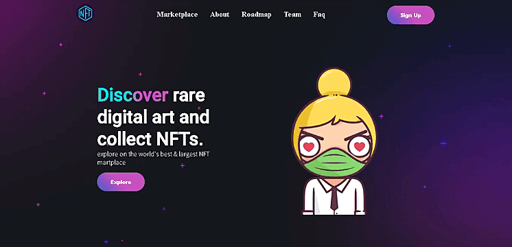

<h1 align="center">Landing page</h1>

<h1>
    
    <h3>Mobile</h3>
    
</h1>

## Sobre o Projeto

Esse projeto foi focado para treinar styled-components do Reactjs

Para ver o projeto web, clique aqui:  <a href="https://landing-pg-first.netlify.app//">Landig Page</a>

## 🚀 Tecnologias utilizadas

- Javascript
- Reactjs
- Styled-Components
- Icons8
- Figurinhas Bigheads
- App-netlify
